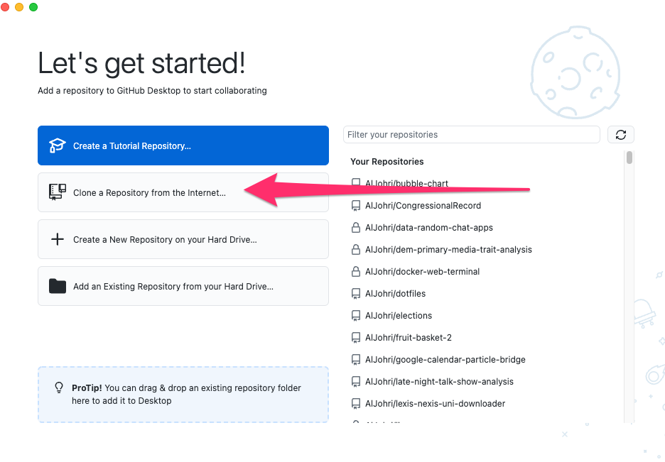
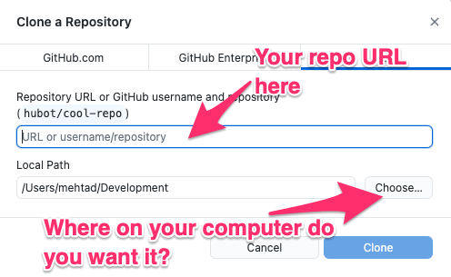

### Fork vs Clone

## Some Vocabulary

* When you **fork** a repository, you're creating a copy in the cloud.
* When you **clone** a repository, you're bringing it down from the cloud to your computer.

## Exercise

1. First we will **fork** this simple website repository https://github.com/data4news/my-simple-website (thus making a copy in GitHub under your own username)

2. Then we will **clone** that fork using GitHub Desktop

