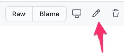
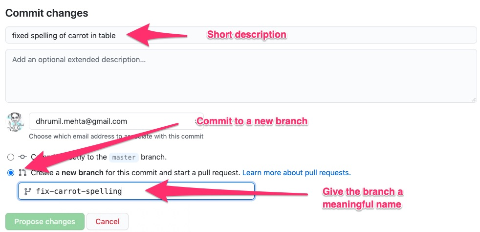

# Social Coding

## Learn by doing!

- Code: https://github.com/data4news/my-simple-website
- Commits: https://github.com/data4news/my-simple-website/commits/master
- Branches: https://github.com/data4news/my-simple-website/branches
- Issues: https://github.com/data4news/my-simple-website/issues
- Projects: https://github.com/data4news/my-simple-website/projects
- Pull Requests: https://github.com/data4news/my-simple-website/pulls

### Exercise

1. Select an issue (or we will select one for you)

    - Assign that issue to yourself and write a comment. 
    - Move the issue to "in progress" on the [project board](https://github.com/data4news/my-simple-website/projects/2).

2. Now let's all take a second to comment on someone else's issue

3. Implement the change on your issue by editing [one of the files here](https://github.com/data4news/my-simple-website). You can do that by first clicking on the name of the file, then hitting the edit button on that file.

    
    
    Then scroll down and commit that change. Make sure to provide a short description of what you did and commit that to a new branch as shown below. 
    
    

4. Wait for Dhrumil to incorporate your change into our website

### Bonus

  1. Make a fork of `my-simple-website`
  2. Host the website on your own GitHub account. To do this, go to settings in your forked repo and [turn on GitHub pages](https://github.com/fivethirtyeight/learning-sessions/blob/master/github/github-intro.md#serving-up-websites). 
  
## In real life!

This is a GitHub **organization** run by various civic technologists (including some great journalists!) who create and maintain various **repositories** that help you work with datasets related to congress and the US Government more broadly.

https://github.com/unitedstates/

We'll look at one **repository** in particular that is home to a dataset with information about members of the United States Congress.

https://github.com/unitedstates/congress-legislators

- Issues: https://github.com/unitedstates/congress-legislators/issues
- Pull Requests: https://github.com/unitedstates/congress-legislators/pulls (look at open and closed ones)
  - simple example: 
	  - https://github.com/unitedstates/congress-legislators/issues/758
  - complex example: 
   	 - pull request: https://github.com/unitedstates/congress-legislators/pull/389