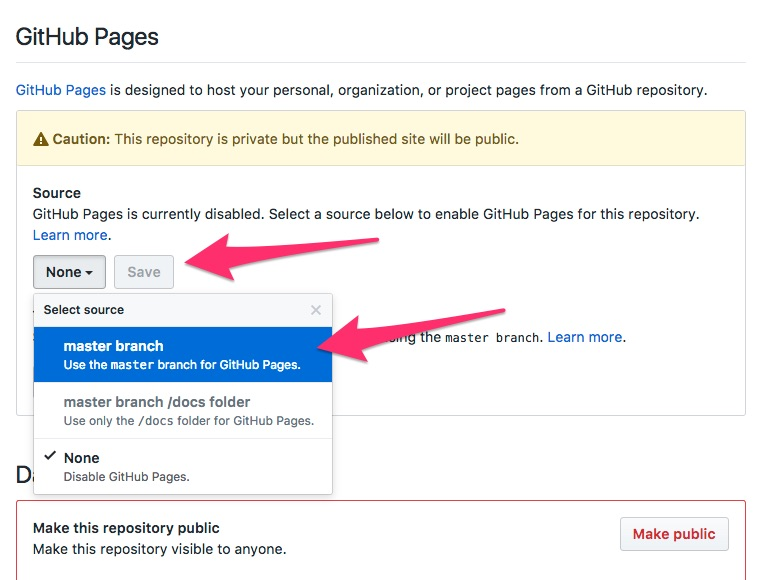

### Fork

### Collaboration

Collaborators can push to the repository without asking your permission, they have full read and write access.


If I wasn't a collaborator, I could still work with you on an open source project through a process called forking where I can make a copy of your repository in my GitHub account, make changes, and request that you merge them back into your project. We will discuss forking more in depth later.

### Serving up Websites!

GitHub is also great for serving up static websites. Right now, you have the code for your website on GitHub, but its not being served up anywhere. GitHub is only storing the code. Luckily, if your code happens to be a website, GitHub can also host it for you through a feature called "GitHub Pages". 

Simply go to the "settings" menu, scroll down to "GitHub Pages", and select "master branch"



Whatever is in your master branch on GitHub should now appear at 

```
http://your-username.github.io/repository-name
```

in my case it is [**http://dmil.github.io/my-simple-website**](http://dmil.github.io/my-simple-website)

## GitHub for things other than code
* Auditing system for changes on a file
* For collaboratively editing a text document
* [For drafting government web design standards!](https://github.com/18F/web-design-standards)
* Open [comment period](https://github.com/whitehouse/source-code-policy/issues?q=is%3Aissue+is%3Aclosed) for policy
* [Drafting](https://github.com/twitter/innovators-patent-agreement) and [collaborating on](https://github.com/twitter/innovators-patent-agreement/issues) legal documents
* Design (image diff) 
	* https://help.github.com/articles/rendering-and-diffing-images/
* Open journalsim showcase
	* 	https://github.com/showcases/open-journalism
* Github for Government
	* https://government.github.com/
	* https://government.github.com/community/

